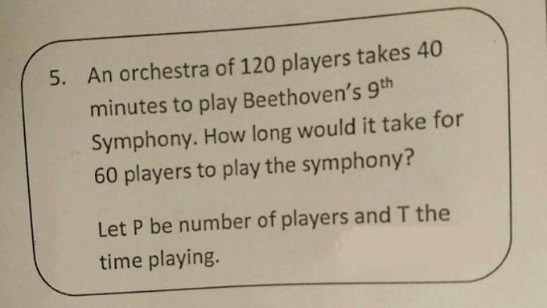

# Time Complexity
_Time complexity_ or _space complexity_ refers to the amount of time (or space) that a given piece of code takes to run on a large volume of data.

One thing to note is that we get concerned with time complexity much more often than we do with space complexity. The reason is simply that computer memory has become very very cheap, so it's not often a business priority to optimize for it. On the other hand, apps are more responsive than ever, and consumer attention spans are the shortest they've ever been, so time is very precious. We will address space complexity considerations, but they will not be the primary focus.

Another note is: while both of these concerns are mathematically valid for small bodies of data, in real life they only ever enter the conversation when we are working with large volumes of data. That's simply because it's not worth our valuable human time to optimize problems that aren't very strenuous for a computer, even if the computer's doing it in an inefficient way.

### Learning Goals
1. Understand the most common and relevant categories of time complexity: constant, linear, logarithmic, and quadratic.
1. Be aware of more exotic categories of time complexity: cubed, exponential, and factorial.
1. Know which categories are preferable and which are to be avoided.
1. Determine the time complexity for a given algorithm.

### First Example
We are going to start with a super simple process that we all know and hate: adding long numbers manually.

Consider the following 2 problems:
```
  540
+ 198
_______
```
```
  540323
+ 198713
____________
```
What is the relationship between the sizes of their inputs? What is the relationship between the amount of time it will take to do them?

We have just observed our first time complexity. For the addition algorithm, if you double the length of the input, you double the time it takes to finish the problem. (And if you triple the input, you triple the time, and so on.) We call this a _linear_ relationship, so long addition has a _linear time complexity_. Let's draw a little graph to see why.

So for the addition algorithm, the time complexity is linear. We notate this as O(n). This is the notation for linear, because the n in the parentheses has no exponent, nor any other function applied to it. Just plain n means linear.

On the other hand, consider the following two problems:
```
  540
x 198
_______
```
```
  540323
x 198713
____________
```
For long multiplication, the second problem (which has double the input size) will _not_ take double the time. It will take more! (We will figure out exactly how much more soon) But for now, our first big revelation is that not all processes have the property that double the work == double the time. And this is the core question of figuring out time complexity: if we double (or triple, or etc) the work, how does it affect the time it takes to do it.

### Constant time
For some tasks, the amount of work does not impact the time it takes to finish at all. We call this a _constant time complexity_. It's notated as O(1). The fact that there's no variable in the parentheses means that even when the workload varies, the time does not.</br>


An example of a constant-time operation is accessing an element in an array.

### Quadratic time
Consider the following code
```
function timeExperiment(n) {
  for (let i = 0; i < n; i++) {
    for (let j = 0; j < n; j++) {
      console.log(i, j)
    }
  }
}
```

If n == 3, how many times will this log? What if n is 5? 10?

This is called _quadratic time complexity_. Quadratic means squared, and the notation for this O(n^2). In code samples, doubly-nested loops are a dead giveaway of a quadratic time complexity.

### Ranking the complexities we know
Start off by graphing our linear example and our quadratic example on the same graph. Assume that each operation takes 1 second. It's pretty clear that our linear example takes less time than our quadratic example! We say that it is less _expensive_: in computer science, expensive always refers to either time or space complexity (and we already know that time is most of our concern).

But what if our linear process took 5 seconds per operation? For low values of n, it would be slower than the quadratic operation. But here is the key: when we assess algorithms for time complexity, we are always talking about how they behave when the workload gets arbitrarily large. So the low range where linear is better is not the concern. The fact that quadratic eventually becomes worse when n gets large enough, means that quadratic is always considered worse.

All categories of time complexity can be compared in this way, and we always only really care in the very high values of n.

Also, note that causing our straight line to become steeper didn't change the fact that eventually the quadratic relationship became worse. For this reason, we don't have relationships like O(5n) or O(2n); those just collapse to the O(n) category. In the same way, there is no such thing as O(3n^2), just O(n^2).

Let's apply this to compare a constant time algorithm to both our linear and our quadratic ones. What if the constant time operation takes 10 seconds? 20? 100?

### Combining time complexities
Revisit our long multiplication problem to figure out its time complexity.

When you have an algorithm that has multiple steps, and each step has a different time complexity, we still only care about what happens when the workload gets really large. So for our multiplication algorithm, we have:
- multiplication phase -> O(n^2)
- addition phase -> O(n)
And we should add them together to figure out the total time. But when n becomes large (which remember, is the only case we really care about), the linear time becomes insignificant compared to the quadratic time. So, we say that the complexity for long multiplication is O(n^2), completely ignoring the linear component, because it eventually gets dwarfed by the quadratic component.

### Logarithmic time
Consider a bacteria that splits in 2 every second. If you start with 1 of these bacteria, how long will it take before you have 8 of them? 64 of them? Draw this relationship onto our graph.

This is called _logarithmic time complexity_, and repeatedly doubling (or tripling, etc) is a dead giveaway that something logarithmic is going on. Also, logarithmic time algorithms can involve repeatedly chopping something in half (or thirds) rather than doubling, if chopping is what gets us closer to our goal. As an example, consider the game of high-low number guessing.

This is notated O(log(n)). Based on the graph, how do you think logarithmic time compares against quadratic, linear, and constant?

### The real takeaway
In general, all this analysis usually results in a simple "yes" or "no" answer to the question of, Is a given algorithm too slow to be useful? And the answer is simple: linear and below is ok, quadratic and above is not ok.

Special note: there are (many terrifying) categories that are worse than quadratic. There are no categories that are better than constant. There is one important category that we haven't talked about yet, because there is no great real-world analog that I know for it. It is O(n\*log(n)), and it happens to be the time complexity of a sorting algorithm called [quicksort](https://en.wikipedia.org/wiki/Quicksort), which is the most widely used sorting algorithm. Even though O(n\*log(n)) is hard to get a feel for, we can graph it and see that it's pretty palatable.

### Identifying the time complexities of some common operations
Note that for these, you should start by defining what's the variable workload (ie what does n represent) in each situation.

1. Watering the plants in a garden (by hand, with a can)
1. Watering the plants in a garden (with a dripline irrigation system)
1. Folding a piece of paper in half repeatedly until it can fit in your wallet
1. Matching socks into pairs after taking them out of the dryer
1. Opening a book to a specific page
1. Finding a specific card in a shuffled deck of cards

### Time complexities of some common operations
It's important to know the time complexities of the following:
- For Arrays:
1. Accessing an element (at an arbitrary position)
1. Inserting an element (at an arbitrary position)
1. Finding a given element (unsorted)
1. Finding a given element (sorted)

- For objects:
1. Accessing an element (at an arbitrary key)
1. Inserting an element (at an arbitrary key)

### Intersection of two arrays
This is a classic problem that tests your ability to itentify the time complexity of algorithms, and decide which implementation is better based on your assessment.

Given two arrays of integers, return an array that contains just the elements that are present in both input arrays. The input arrays are not guaranteed to be sorted, but any given element will only appear once in a given input array.

Sample 1: intersection([0, 1, 4, 5, 8], [0, 2, 7, 9, 4]) -> [0, 4]

### The terrifying categories that are worse than quadratic and definitely not acceptable
In increasing level of bad-ness:

1. Any exponent higher than 2 on n: O(n^3), O(n^4), etc. These happen when you have 3-level (or 4-level, etc) nested loops.
1. Exponential: O(2^n), although 2 can be replaced with any number here without changing the meaning. One well-known example of this is the recursive solution to fibonacciSequence.
1. Factorial: O(n!). A well-known example is the brute-force solution to the travelling salesman problem, or the knapsack problem.
